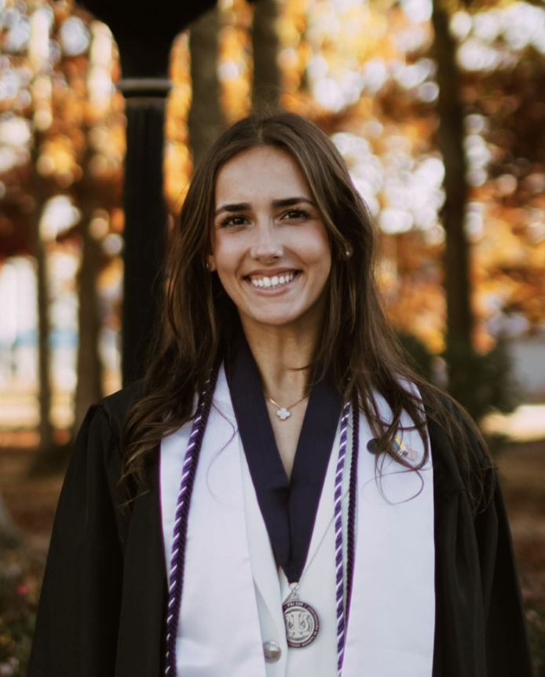
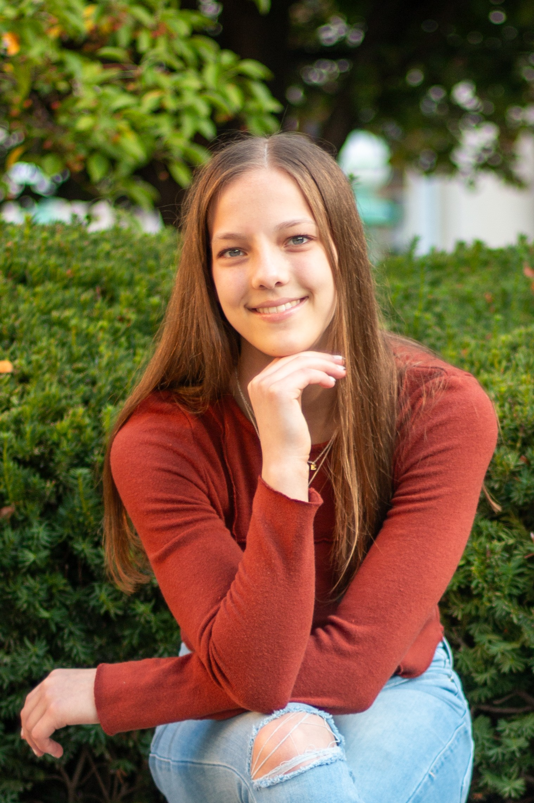
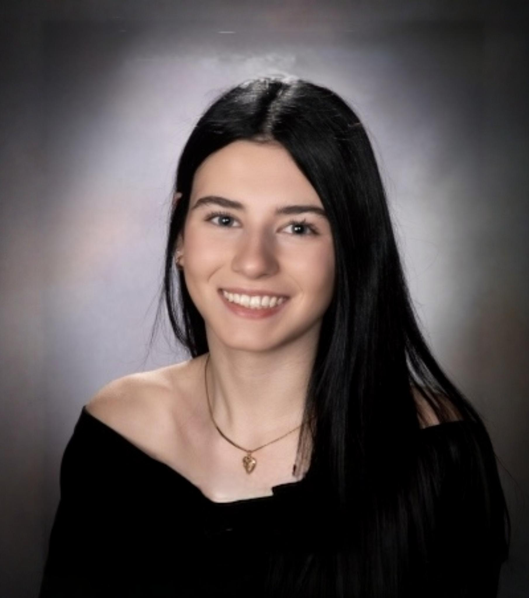
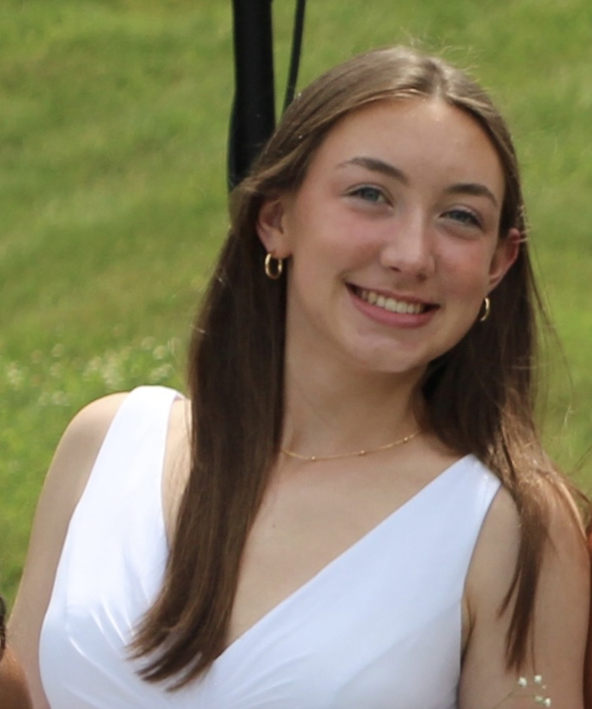

## Principal Investigator

{width=200px .headshot}


**Dr. Nathaniel R. Greene**  
Assistant Professor, Department of Psychological and Brain Sciences,
Villanova University  

My research focuses on how people remember past experience, with a particular emphasis on the precision or quality of what people remember or, conversely, what they forget. This research seeks to identify mechanisms underlying why our episodic memories are often fuzzy, especially as we age into older adulthood. To address these questions, I combine behavioral experimentation with computational modeling to study memory across different timescales and levels of representation.

---

## Graduate Students

```{=html}
<div class="person-row">

  

  <div class="person-info">
    <strong>Olivia Bereza</strong><br>
    M.S. Student<br>
    My research interests and pursuits within the lab center on face perception and memory. I am particularly interested in investigating the nuances that underlie our tendency to perceive faces where none exist (face-pareidolia), and what this phenomenon reveals about the mechanisms of face processing and memory. Of special interest would be to extend such research to clinical populations, such as individuals with prosopagnosia, the inability to recognize faces. More broadly, I am interested in the neural and biological underpinnings of cognition, perception, and behavior.
  </div>

</div>
```

## Undergraduate Researchers

```{=html}
<div class="person-row">

  

  <div class="person-info">
    <strong>Elin Moore</strong><br>
    Undergraduate Research Assistant<br>
    I want to become a sport psychologist because I grew up as a competitive gymnast. During my training, I once held a handstand for 10 minutes!
  </div>

</div>
```

```{=html}
<div class="person-row">

  

  <div class="person-info">
    <strong>Mia Wolos</strong><br>
    Undergraduate Research Assistant<br>
    I am interested in studying memory as it pertains to the healthcare system, such as Dementia and Alzheimer's, since I am a pre-medical student.
  </div>

</div>
```

```{=html}
<div class="person-row">

  

  <div class="person-info">
    <strong>Colleen Ganley</strong><br>
    Undergraduate Research Assistant<br>
    I am a pre-med biology major minoring in psychology. I am interested in studying neurodegenerative disorders that specifically impact memory.
  </div>

</div>
```