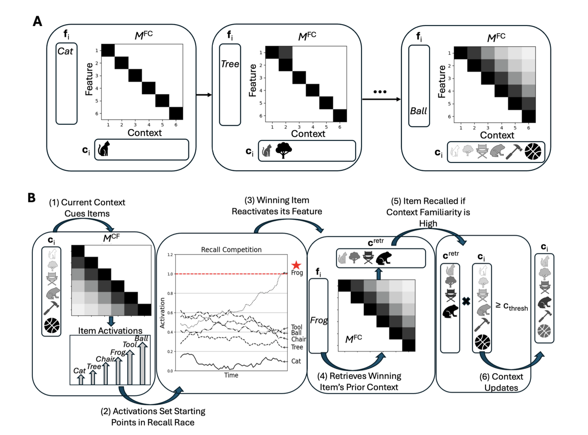

## Overview

Research in the MIND Lab seeks to explain the dynamics of human memory -- how it works, and why it sometimes fails us -- through a combination of behavioral experiments and computational modeling approaches. 

## Research Areas


### When and why memories lose specific details

Our memories are rarely perfect portrayals of our past experiences. Do you remember exactly what was said in a conversation you had yesterday, or what color shirt your friend was wearing? Chances are, those specific details are gone, even though you still remember *what* the conversation was about. This is a feature, not a bug, of human memory: preserving the core essence or gist of our experiences helps us make sense of the world. But there are also situations in which access to specific details matters—such as when taking an exam or remembering whether you took your medication today. What determines whether those details are available?

We study the conditions under which episodic memory preserves fine-grained details versus collapsing to gist-level information. Across paradigms, we ask what *representational content* is available at retrieval, and what mechanisms constrain access to specific details when they matter. In this work, we consider the roles of factors such as attention, working memory demands, processing speed, and retrieval dynamics in shaping whether memory supports detailed versus more generalized representations.

**Selected publications**
- [Greene & Naveh-Benjamin, 2022](publications.html#ref-greene2022divided)
- [Greene & Naveh-Benjamin, 2024](publications.html#ref-greene2024time)


### Adult age-related changes in memory specificity

A central theme of the lab is understanding how and why memory becomes less specific with healthy aging. We use behavioral methods and mathematical modeling to distinguish changes in the representational quality of memory from changes in other processes, like different decision processes between young and older adults. More recently, we have begun tackling the question of *why* memories become "fuzzier" as we age through the lens of computational models of memory.

**Selected publications**
- [Greene & Naveh-Benjamin, 2020](publications.html#ref-greene2020specificity)
- [Greene & Naveh-Benjamin, 2023](publications.html#ref-greene2023adult)


### Attention, working memory, and long-term memory

We examine how attention and working memory shape what becomes durable in long-term memory—especially under conditions of overload, distraction, or competition. This work connects classic capacity limits to downstream consequences for memory precision and generalization.

**Selected publications**
- [Greene, Guitard et al., 2024](publications.html#ref-greene2024working)
- [Cowan et al., 2024](publications.html#ref-cowan2024relation)

### Metamemory and memory specificity

We explore the relation between people's objective memory strengths and their perception of their memories, particularly in situations requiring people to remember specific details. We aim to understand how the memory-metamemory relation evolves across the human lifespan.

**Selected publications**
- [Greene, Forsberg et al., 2024](publications.html#ref-greene2024lifespan)
- [Greene, Chism, & Naveh-Benjamin, 2022](publications.html#ref-greene2022levels)


## Computational Modeling

**Retrieved Context Models**

See our recent pre-print:
[Greene, Guitard, & Naveh-Benjamin — Process Explanations of Age-Related Changes in Memory Specificity](publications.html#greene-process-preprint)


```{=html}

<div class="cmr-stepper" id="cmrStepper">
  <div class="cmr-figure-wrap">
    

    <!-- overlay rectangles get injected by JS -->
    <div class="cmr-overlay"></div>

    <div class="cmr-badge" id="cmrBadge">1/7 Encoding: (Cat)</div>
  </div>

  <div class="cmr-controls">
    <button type="button" class="cmr-btn" id="cmrPrev">Prev</button>
    <button type="button" class="cmr-btn" id="cmrPlay">Play</button>
    <button type="button" class="cmr-btn" id="cmrNext">Next</button>
  </div>
</div>

<p class="cmr-caption">
  Click through to see how encoding and retrieval unfold in a retrieved-context model.
</p>


<style>
  .cmr-figure-wrap{
    position:relative;
    display:inline-block;
    max-width: 85%;
    overflow: hidden;
  }
  .cmr-figure{
    width:100%;
    height:auto;
    display:block;
  }
  .cmr-overlay{
    position:absolute; inset:0;
    pointer-events:none;
  }
  .cmr-rect{
    position:absolute;
    border: 3px solid rgba(0, 123, 255, 0.95);
    border-radius: 6px;
    box-shadow: 0 0 0 4px rgba(0,123,255,0.15);
    transition: opacity 200ms ease;
  }
  .cmr-caption{
  text-align:center;
  margin-top: 10px;
  font-size: 0.95rem;
  opacity: 0.85;
  }

 

  /* when we “light” a panel, we punch through the dim using a bright rect + per-rect backdrop */
  .cmr-spot{
    position:absolute;
    background: rgba(255,255,255,0.0);
    box-shadow: 0 0 0 9999px rgba(0,0,0,0.75),
                0 0 18px rgba(0,123,255,0.85);
    border-radius: 10px;
    pointer-events:none;
  }

  .cmr-badge{
    position:absolute;
    top: 10px; left: 10px;
    background: rgba(255,255,255,0.9);
    padding: 6px 10px;
    border-radius: 8px;
    font-size: 14px;
  }
  .cmr-controls{
    margin-top: 12px;
    display:flex;
    gap:10px;
    justify-content:center;
  }
  .cmr-btn{
    padding: 6px 12px;
    border-radius: 8px;
    border: 1px solid #ccc;
    background: #fff;
    cursor:pointer;
  }
</style>

<script>
document.addEventListener("DOMContentLoaded", () => {
  const root = document.getElementById("cmrStepper");
  if (!root) return;

  const overlay = root.querySelector(".cmr-overlay");
  const badge = document.getElementById("cmrBadge");
  const figureWrap = root.querySelector(".cmr-figure-wrap");
  figureWrap.classList.add("dim");
  const prevBtn = document.getElementById("cmrPrev");
  const nextBtn = document.getElementById("cmrNext");
  const playBtn = document.getElementById("cmrPlay");

  // Coordinates are % of the image (left, top, width, height).
  // You’ll tweak these once; after that it’s perfect forever.
  const steps = [
    {label:"Encoding: Cat",  rect:{l:  6, t: 5, w: 28, h: 38}},
    {label:"Encoding: Tree", rect:{l: 35.5, t: 4.8, w: 27, h: 38}},
    {label:"Encoding: Ball", rect:{l: 66, t: 4.8, w: 29, h: 38}},
    {label:"Retrieval: Cue items",        rect:{l:  4.5, t: 43, w: 28, h: 57}},
    {label:"Retrieval: Recall competition",rect:{l: 26, t: 43, w: 29.5, h: 50}},
    {label:"Retrieval: Retrieve context", rect:{l: 52, t: 52, w: 22, h: 40}},
    {label:"Retrieval: Context updates",    rect:{l: 65, t: 43, w: 31, h: 50}},
  ];

  let i = 0;
  let timer = null;
  const STEP_MS = 1400; // <- slow it down here

  function pctRectToStyle(r){
    return `left:${r.l}%; top:${r.t}%; width:${r.w}%; height:${r.h}%;`;
  }

  function render(){
    overlay.innerHTML = "";
    const r = steps[i].rect;

    // spotlight punch-through dim
    const spot = document.createElement("div");
    spot.className = "cmr-spot";
    spot.style.cssText = pctRectToStyle({l:r.l-1, t:r.t-1, w:r.w+2, h:r.h+2});
    overlay.appendChild(spot);

    // blue outline
    const box = document.createElement("div");
    box.className = "cmr-rect";
    box.style.cssText = pctRectToStyle(r);
    overlay.appendChild(box);

    badge.textContent = steps[i].label;
  }

  function next(){ i = (i+1) % steps.length; render(); }
  function prev(){ i = (i-1+steps.length) % steps.length; render(); }

  function play(){
    if (timer){
      clearInterval(timer);
      timer = null;
      playBtn.textContent = "Play";
      return;
    }
    playBtn.textContent = "Pause";
    timer = setInterval(next, STEP_MS);
  }

  prevBtn.addEventListener("click", prev);
  nextBtn.addEventListener("click", next);
  playBtn.addEventListener("click", play);

  render();
});
</script>
```
